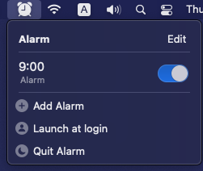

# Alarm for macOS

A simple alarm app that works on the status bar for macOS.

- [Getting Started](#getting-started)
    - [Requirements](#requirements)
- [Usage](#usage)
    - [Initial launch](#initial-launch)
    - [Add an Alarm](#add-an-alarm)
    - [Delete an Alarm](#delete-an-alarm)
    - [Disable an Alarm](#disable-an-alarm)
- [Author](#author)
- [License](#license)

## Getting Started

### Requirements

* macOS 11.0+
* Xcode 12.4+
* Swift 5.0+

## Usage

### Initial launch

Notifications will appear in the macOS notification area, please allow notifications for this app.

### Add an Alarm

1. Tap the icon on the status bar.
2. Select `Add Alarm`.
3. Set the time and press `Save`.

### Delete an Alarm

1. Tap the icon on the status bar.
2. Select `Edit`.
3. Press the minus button to the left of the alarm to delete the alarm.

### Disable an Alarm

1. Tap the icon on the status bar.
2. Turning off the alarm toggle will disable the alarm.

## Author

Watanabe Toshinori – toshinori_watanabe@tiny.blue

## License

This project is licensed under the MIT License. See the [LICENSE](LICENSE) file for details.
